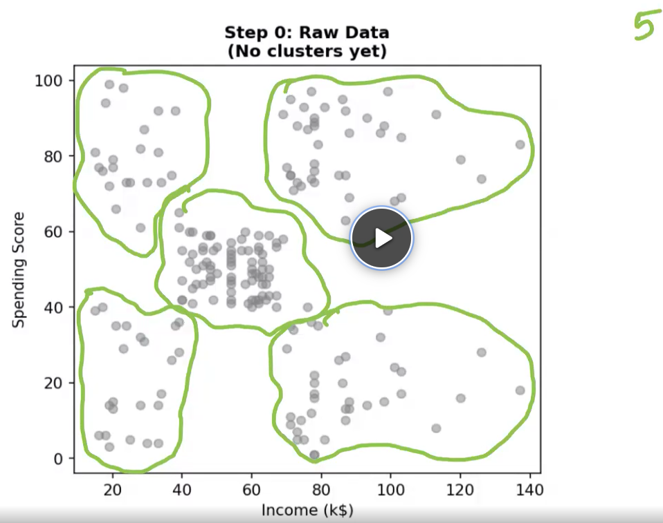
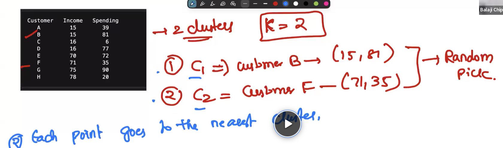
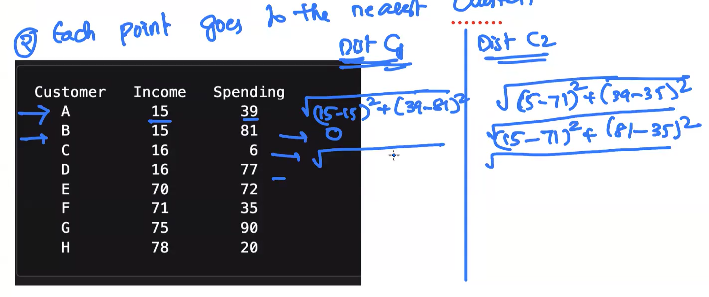
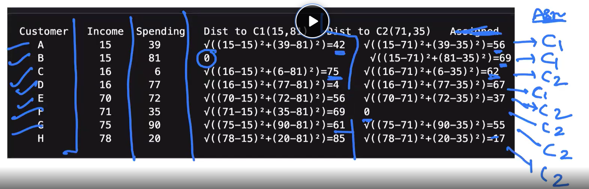
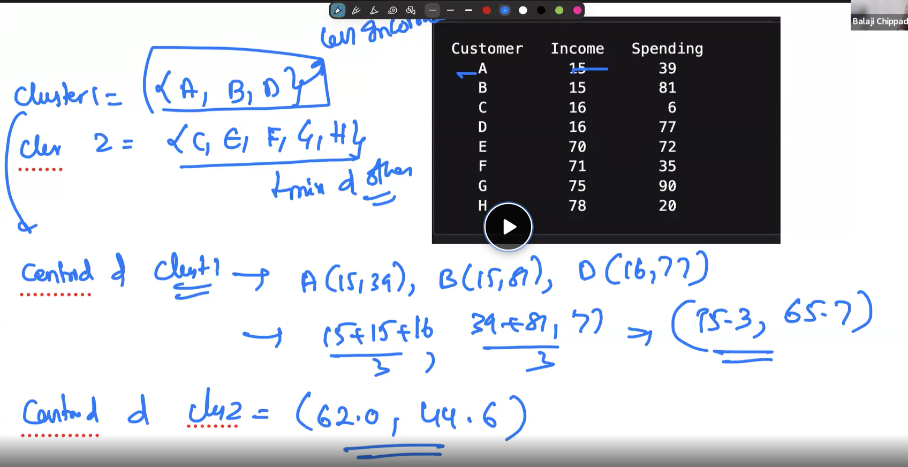
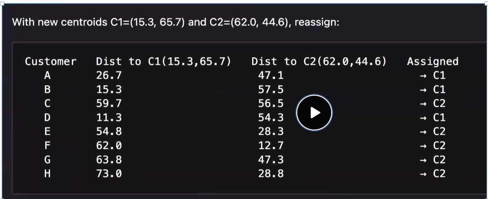
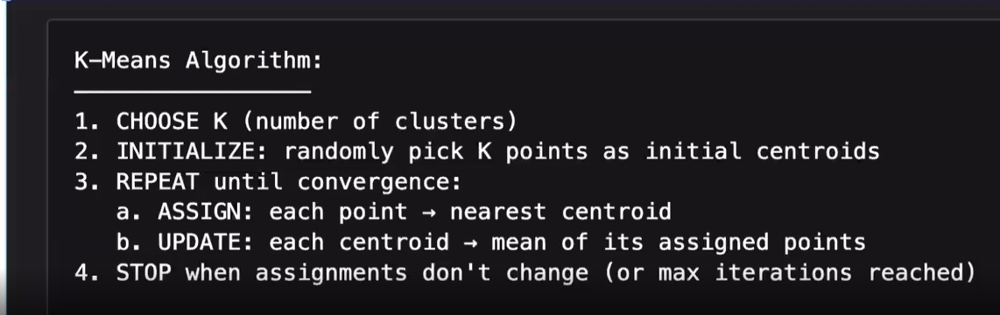
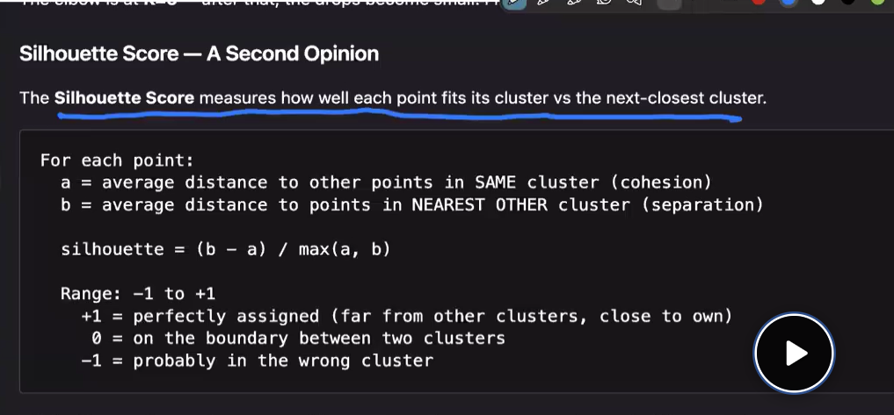

## CLUSTURING
- Until now we have used many alogo's like Linear reg, logistic reg,Decision tree, random forest etc. All of them depend on a target column, i.e, the main job of those algo's is to find the target column value. hat if the target column doesn;t exists???  These also's are useless. That is when **Clusturing** comes into pic.
- Grouping the data into categories is known as ***Clusturing***.
- 
- Generally clusturing means, the dataset will not be labelled, that is the reason "Clusturing" is under ***Unsupervised Learning***.
- Now, some of the common problems taht clustering solves are:
   - New articles, unlabelled, will be clustured together like: sports, crime, health etc.
   - Movie lovers: action, crime, mystery etc.
   - Participant iof ecommerce websites and their behaviour.
# Clustering Model Evaluation

Unlike classification, clustering is an **unsupervised learning** technique, meaning there are **no true labels** to compare against. Therefore, we evaluate clustering by checking how well the data has been grouped rather than measuring prediction accuracy.

---

# Questions Asked During Clustering Evaluation

## 1. Are the clusters well separated?

### Question
> Are different clusters far away from each other?

A good clustering algorithm should create clusters that are **distinct** and **do not overlap much**. This is known as **Inter-cluster distance**.

### Good Example

```
● ● ● ● ●


          ▲ ▲ ▲ ▲ ▲
```

### Poor Example

```
● ▲ ● ▲ ▲ ● ▲ ●
```

Here, the clusters overlap significantly, making them difficult to distinguish.

---

## 2. Are the points within the same cluster similar?

### Question
> Are members of the same cluster close to each other?

A good cluster should contain data points that are highly similar.

### Good Example

```
Cluster A (Age)

23
24
22
25
24
```

All members are very similar.

### Poor Example

```
Cluster A (Age)

20
65
38
80
12
```

The members vary widely, indicating poor clustering.

This property is known as **high intra-cluster similarity (or cohesion).**

---

## 3. Does every point belong to the appropriate cluster?

### Question
> Does this point really belong with the other points in the cluster?

Although we usually don't have labels, we can often inspect whether a point logically fits into its assigned cluster.

Example:

```
Dog
Dog
Dog
Cat
Dog
```

The "Cat" appears to be incorrectly grouped with dogs.

---

## 4. Is the chosen number of clusters appropriate?

### Question
> How many clusters should the algorithm create?

For example, when clustering customers:

Should there be:

```
2 clusters?
```

or

```
5 clusters?
```

or

```
20 clusters?
```

There is usually no single correct answer.

Common techniques for choosing the number of clusters include:

- Elbow Method
- Silhouette Score

---

## 5. Are the clusters meaningful?

### Question
> Can humans interpret these clusters?

Example of meaningful clusters:

```
Cluster 1
---------
Students
Young
Low income

Cluster 2
---------
Working professionals

Cluster 3
---------
Retired customers
```

These clusters are easy to understand and useful for business decisions.

If each cluster contains a random mixture of different customer types, the clustering may not be useful.

---

## 6. Are there any outliers?

### Question
> Are there points that don't belong to any cluster?

Example:

```
● ● ● ● ●

▲ ▲ ▲ ▲ ▲


                 ★
```

The star is far away from every cluster.

This could indicate:

- Fraud
- An anomaly
- Incorrect data
- A rare event

---

## 7. Are the clusters stable?

### Question
> Will the algorithm produce similar clusters if we rerun it?

Run 1

```
Cluster A
A B C D

Cluster B
E F G H
```

Run 2

```
Cluster A
A B D

Cluster B
C E F G H
```

If the clustering changes drastically with small changes in the data, it may not be reliable.

---

# Common Clustering Evaluation Metrics

| Metric | Measures | Better Value |
|----------|----------|--------------|
| **Silhouette Score** | Balance between cluster cohesion and separation | Higher (Range: -1 to 1) |
| **Inertia (WCSS)** | Sum of squared distances of points from their cluster centroid | Lower |
| **Elbow Method** | Helps determine the optimal number of clusters | Look for the "elbow" point |
| **Davies-Bouldin Index** | Ratio of within-cluster similarity to between-cluster separation | Lower |
| **Calinski-Harabasz Index** | Ratio of between-cluster dispersion to within-cluster dispersion | Higher |

---

# If True Labels Are Available

Sometimes clustering is performed on a labeled dataset to compare the discovered clusters with the actual classes.

In such cases, the following metrics can be used:

- Adjusted Rand Index (ARI)
- Normalized Mutual Information (NMI)
- Homogeneity
- Completeness
- V-Measure

These compare the generated clusters against the true labels.

---

# Interview Summary

When asked **"How do you evaluate a clustering model?"**, the expected points are:

1. **Are points within the same cluster close together?** (High Cohesion)
2. **Are different clusters well separated?** (High Separation)
3. **Is the chosen number of clusters appropriate?**
4. **Are the clusters stable across multiple runs?**
5. **Are the clusters meaningful and useful from a business perspective?**

---

# Key Takeaway

A good clustering model should have:

- ✅ High intra-cluster similarity (high cohesion)
- ✅ High inter-cluster separation
- ✅ Appropriate number of clusters
- ✅ Stable results
- ✅ Meaningful and interpretable clusters
--------------------------------------------------------


- The clustured marked, is our target, to find them. The also we are going to use is ***K-MEANS CLUSTURING ALGO***
- **STEP-1: Pick random points from the dataset as initial centroids.** 

- **STEP-2: Calculate distance from the above picked cenroids to every data points**


- **STEP-3: Calculate the new centroids, from the obtained initial level clusters.**

- **STEP-4: Now with the new centroids, calculate the distance to every data point**

- **Repeat the steps from 3 to 4, until we get the same clustures in different iterations, i.e , the same data points going into same clustures, as their prev. iterations. When this happens, then it means that the algo has "Converged".**
- **So, basically, this process repeats until the centroids and clustures are same, i.e, until "Convergence" is attained.**


## Biggest question - How to decide the k(No.of clustures to consider)
- Here, "K" is a hyper-parameter.
- By tuning this hyper parameter and calculating inter(distance b/w centroids of clusters) and intra(distance between centroid and points in a cluster) cluster, the 
"Silhouette Score" is calculated. This will tell us how efficent is the clusturing done by our model. Higher the score, best is the clusturing.
- Scaling has to be done, inorder to give equal imp to all features.
----------------------------------------------------------

------------------CALCULATION OF SILHOUETTE SCORE(WITH EXAMPLE)------------------------
# Silhouette Score - Complete Explanation

The **Silhouette Score** is one of the **most popular internal evaluation metrics** for clustering.

It measures **how well each data point fits into its assigned cluster**.

It answers two questions simultaneously:

1. **Is the point close to other points in its own cluster?** (Cohesion)
2. **Is the point far away from points in other clusters?** (Separation)

A good clustering algorithm should satisfy both.

---

# Step 1: Understand the Two Distances

For **every data point**, we calculate two values:

- **a(i)** → Average distance to all other points in the **same cluster**
- **b(i)** → Average distance to points in the **nearest neighboring cluster**

---

## a(i): Intra-cluster Distance

This measures how close a point is to other points in its own cluster.

Example:

```
Cluster A

P1   P2   P3   P4
```

Suppose we want the silhouette score for **P1**.

Calculate the distance from P1 to every other point in Cluster A.

```
Distance(P1, P2) = 2

Distance(P1, P3) = 4

Distance(P1, P4) = 6
```

Average these distances:

```
a(i)

= (2 + 4 + 6) / 3

= 4
```

Smaller **a(i)** is better because the point is close to its own cluster.

---

## b(i): Inter-cluster Distance

Now compare P1 to every **other cluster**.

Suppose we have

```
Cluster A

P1 P2 P3 P4

Cluster B

Q1 Q2 Q3
```

Calculate P1's distance to every point in Cluster B.

```
Distance(P1,Q1)=10

Distance(P1,Q2)=12

Distance(P1,Q3)=14
```

Average:

```
= (10+12+14)/3

=12
```

Suppose there is another cluster:

```
Cluster C

R1 R2 R3
```

Average distance:

```
8
```

Since Cluster C is **closer**, we choose the **smallest average distance**.

```
b(i)=8
```

This is called the **nearest neighboring cluster**.

Larger **b(i)** is better because it means the point is far away from other clusters.

---

# Step 2: Apply the Formula

The silhouette score for one point is

\[
s(i)=\frac{b(i)-a(i)}{\max(a(i),b(i))}
\]

where

- **a(i)** = average distance within its own cluster
- **b(i)** = average distance to the nearest neighboring cluster

---

# Example 1 (Good Point)

Suppose

```
a(i)=2

b(i)=8
```

Formula:

```
(8-2)/max(2,8)

=6/8

=0.75
```

Silhouette Score = **0.75**

This is a good score because:

- The point is close to its own cluster.
- The point is far from other clusters.

---

# Example 2 (Bad Point)

Suppose

```
a(i)=6

b(i)=7
```

```
(7-6)/7

=1/7

≈0.14
```

The point is almost equally close to another cluster.

This indicates poor clustering.

---

# Example 3 (Wrongly Clustered Point)

Suppose

```
a(i)=8

b(i)=4
```

```
(4-8)/8

=-4/8

=-0.5
```

Negative score!

This means the point is **closer to another cluster than to its own cluster**.

It is probably assigned to the wrong cluster.

---

# Range of Silhouette Score

The score always lies between

```
-1 to +1
```

---

## Score Close to +1

```
+1
```

Meaning:

- Very close to own cluster
- Very far from neighboring clusters

Excellent clustering.

---

## Score Around 0

```
0
```

Meaning:

The point lies near the boundary between two clusters.

Example:

```
● ● ● ● ▲ ▲ ▲ ▲
          ↑
```

The point in the middle could belong to either cluster.

---

## Score Close to -1

```
-1
```

Meaning:

The point is closer to another cluster than its assigned cluster.

It is probably misclassified.

---

# Visual Intuition

## Good Cluster

```
● ● ● ●


                  ▲ ▲ ▲ ▲
```

For a point here,

```
a(i) = Small

b(i) = Large

Silhouette ≈ 1
```

---

## Overlapping Clusters

```
● ● ▲ ● ▲ ▲ ●
```

For many points,

```
a(i)

≈

b(i)
```

Silhouette ≈ 0

---

## Wrong Cluster Assignment

```
● ● ●

      ▲

▲ ▲ ▲ ▲
```

The highlighted point belongs with the triangles, not the circles.

```
a(i)>b(i)
```

Silhouette becomes negative.

---

# Overall Silhouette Score

The silhouette score of the clustering model is simply the **average silhouette score of all data points**.

\[
\text{Overall Silhouette Score}
=
\frac{s_1+s_2+\cdots+s_n}{n}
\]

where:

- \(s_1, s_2, ..., s_n\) are the silhouette scores of individual data points.
- \(n\) is the total number of data points.

---

# Interpretation

| Silhouette Score | Interpretation |
|------------------|----------------|
| **0.71 to 1.00** | Excellent clustering |
| **0.51 to 0.70** | Good clustering |
| **0.26 to 0.50** | Weak but acceptable clustering |
| **0.00 to 0.25** | Poor clustering |
| **Less than 0** | Many points are assigned to the wrong clusters |

> **Note:** These are general guidelines, not strict rules.

---

# Advantages

- Considers both:
  - Cohesion
  - Separation
- Does not require true labels.
- Helps compare different clustering algorithms.
- Can be used to choose the optimal number of clusters (the value of **K** with the highest average silhouette score is often preferred).

---

# Limitations

- Computationally expensive for very large datasets because it requires calculating distances between many pairs of points.
- Works best when clusters are compact and well-separated.
- May not perform well for clusters with irregular shapes or varying densities.

---

# Interview Answer (30 Seconds)

> The **Silhouette Score** is an internal clustering evaluation metric that measures how well each data point fits into its assigned cluster. For every point, it compares the **average distance to points in its own cluster** with the **average distance to points in the nearest neighboring cluster**. The score ranges from **-1 to 1**, where values close to **1** indicate well-clustered points, values near **0** indicate points on cluster boundaries, and **negative values** indicate that points may have been assigned to the wrong cluster.