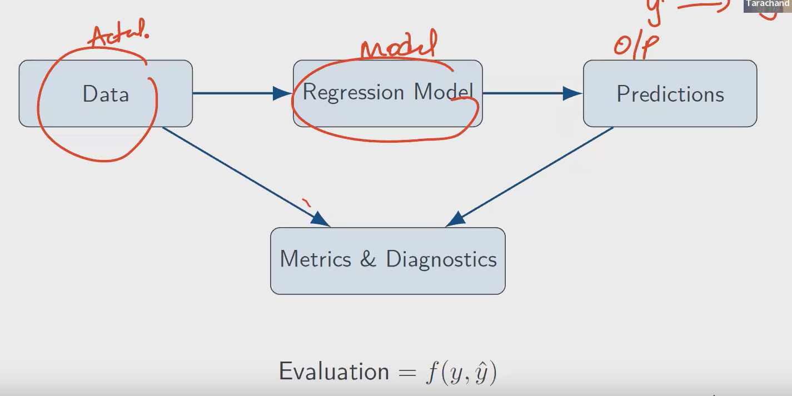
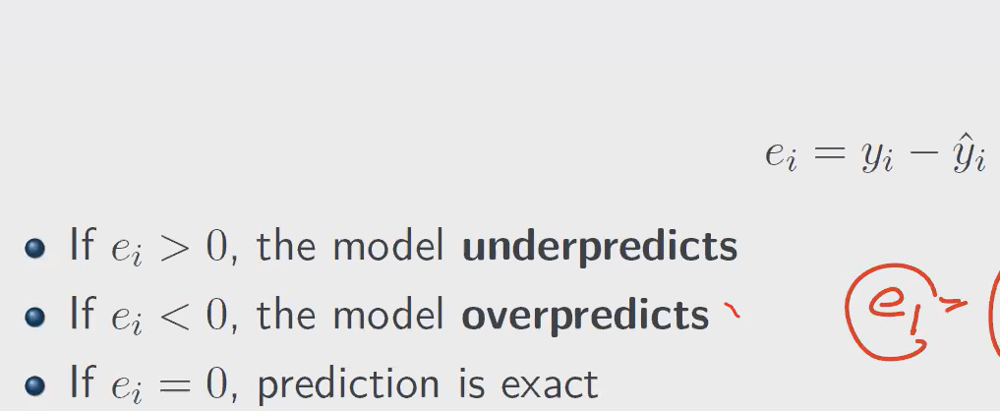
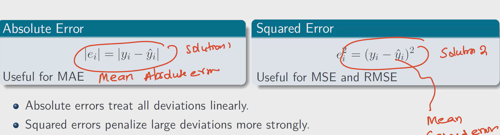

- Metrics are MAE(Mean Absolute error), MSE(Mean squared error), RMSE(Rooted mean square error), R^2 and Adjusted R^2.

Here calcellations means, the negative values from getting subtracted or getting cancelled with +ve ones.
