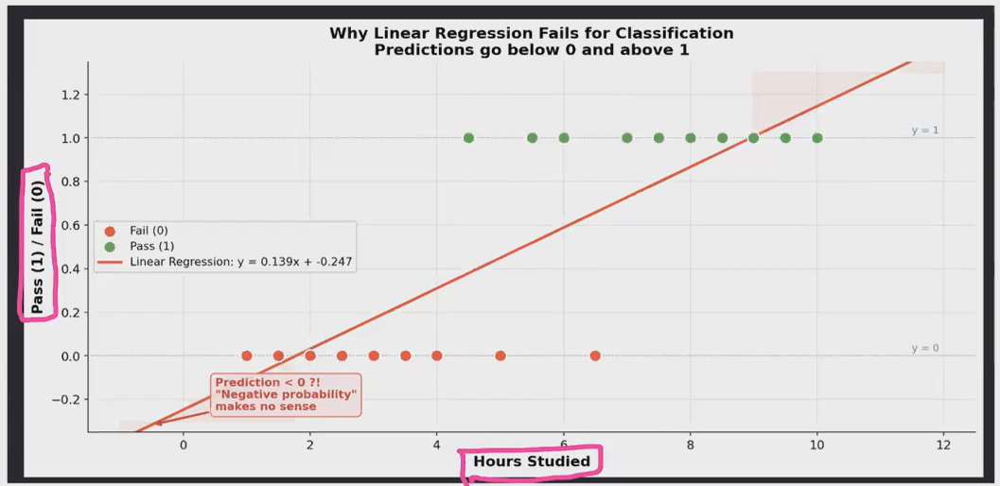
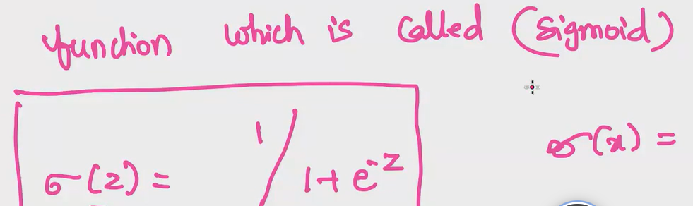
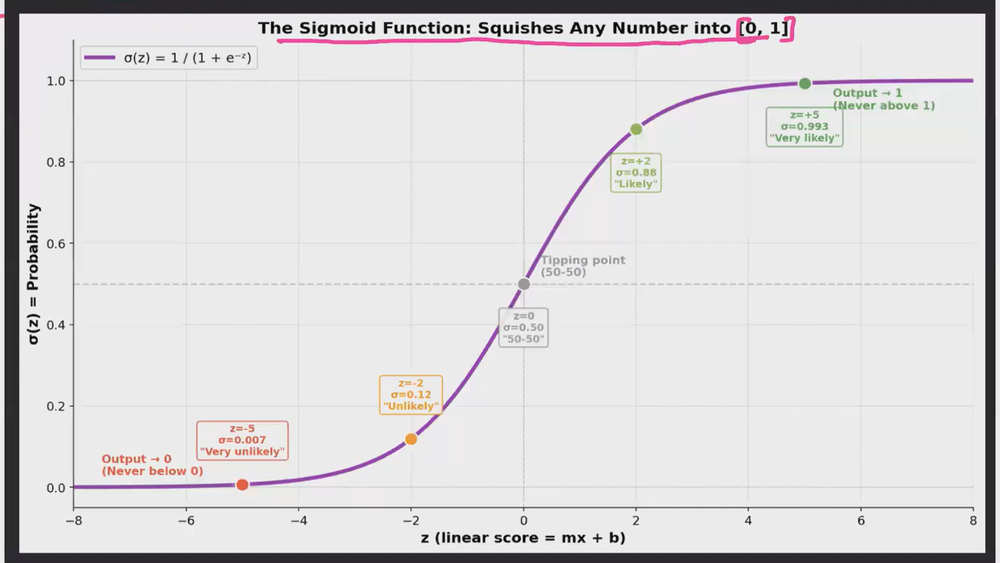
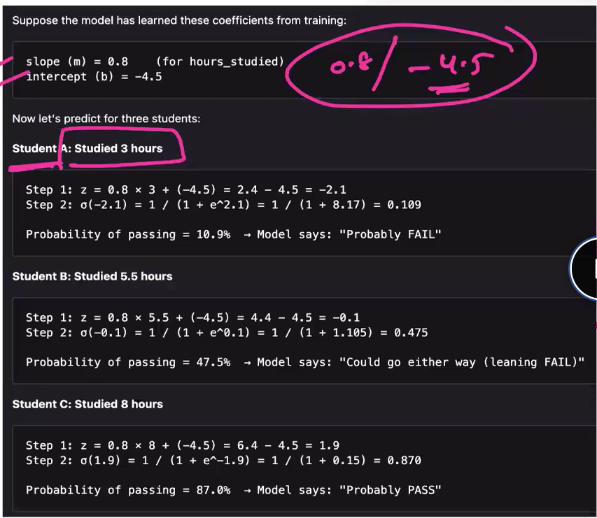
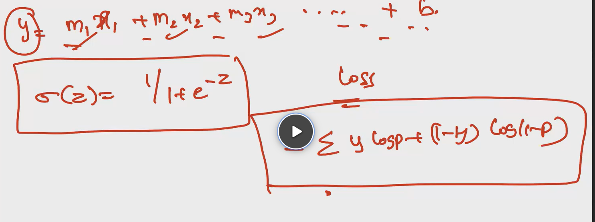
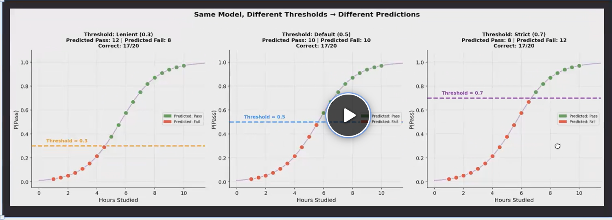

## Logistic Regression

- We will not alays have problems that gives result as a continuous number. We will also have problems where the result will be like pass/fail, ok/not ok, this/that. 
- This kind of problems can be solved using **Logistic Regression**.
- But why the name is **Regression**, solving a **classification** problem????

- From the above image, we are able to see that a straight line( which will always be the case in Logistic Regression) is not covering all the points. So there will never be a best fit line, for a classification problem, if we use Linear Regression.
- And, the line is also covering negative, decimal values which doesn't make sence in a classification problem.
- When we have outliers, then the best-fit line will shift, that tries to cover all the points, so that the line is within the small distance from the data points.

When Logistic Regression(LoR) is applies, the result will be the probability of the an ouytcome, for the given input. The values always lie b/w 0-1. Eg: 0.95 -> this the probability of a mark(56) getting passed.

- Even internally, Logistic regression as well uses the "y=mx+c" formula, to find the predicted vale. But snce the logistic regression allows only 0 or 1, a **Sigmoid Function** is applid on the result of ***y***, to get it in the range of 0 to 1.

This is the formula for sigmoid function, where ***z*** is the result of ***y***.

- There will be some situations where we need to decide the treshhold, to switch from 0 to 1. 
- Eg: Cancer detection: If by default 0.5 is the tresh hold, the we might ignore people who have 30% chance of getting cancer. So in this case we can set the tresh hold as 0.1, meaning consider people who have 10% and above, chance of getting cancer.
- This treshhold has to be decided based on the usecase.    
