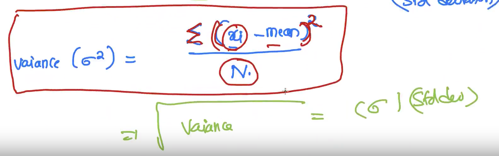
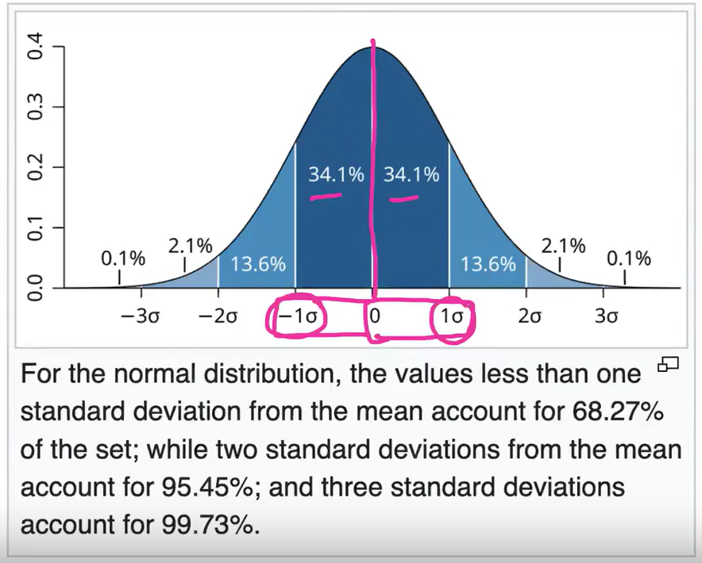
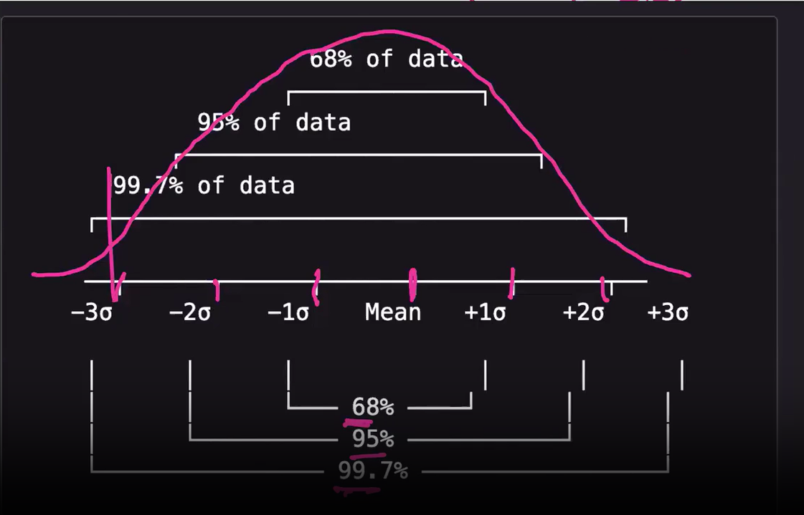
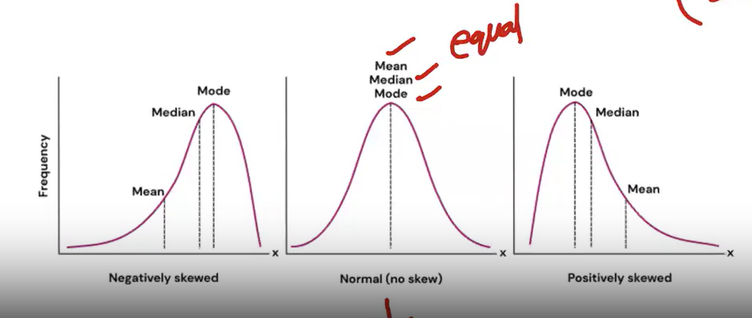
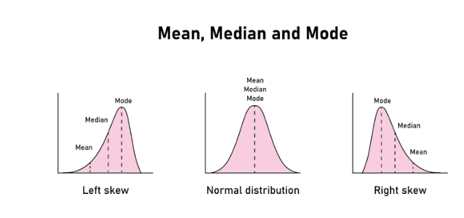
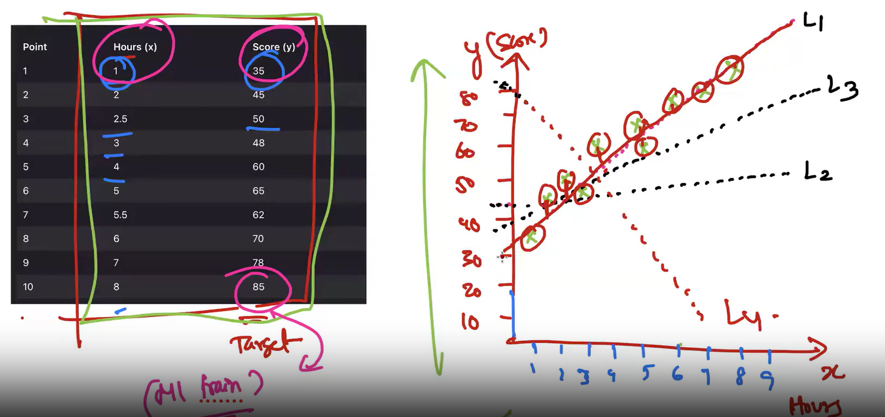

### Mean:
- It is the arithmatic average of a column, i.e sum of elements / count of the elements.
- middle value.
- If any one of the elemnent is out of range from the distribution of the elements, then the mean will inflate. So, it is highly sensitive to outliers.

### Median:
- Middle value when the list is sorted.
- When even no,of elements, then middle two numbers / 2.
- This just the robust value which only cares about the posistion.
- So, it is less sensitive to outliers. This is the reason, why the na's are mostly filled with median.

### Mode:
- Most repeated element.
- If every element is repeated only 1 y=time, then there will be no mode.
- If data is categorical or discreet, then it is always recommended to use Mode for fillng na.

### Variance/ Standard Deviation: 
- Variance is basically how wide spead is my data. 
Eg: set1 -> 10,12,15,17,19,23
set2 -> 12,45,67,90,120,170.
Now the range of set1 if from 10 to 23 which is small. The range of set2 is very high i.e, 12 to 170. 
This is known as ***Variance***.
#### Variance Calculation:
data = [4,8,6,2,10]
- Step 1: Calculate average.
(4+8+6+2+10)/5 = 6
- Step 2: Calculate how far is each data point from average.
4-6=-2, 8-6=2, 6-6=0,6-2=4,10-6=4
- Step 3: Do sqaure of the above results.
- -2^2 = 4, 2^2=4, 0^2=0, 4^2=16, 4^2=16.
- Average of above values
(4+4+0+16+16) = 40/5 = 8. **8 is the Variance**
- **SquareRoot(8) = Standard Deviation. ==> 2.83**

### Why are we doing square instead of taking absolute number in step-3????

- This is because, we need to handle two things here, one is that the outliers should have a visible impact on variance. So when a large negative number occures, then instead of taking abs, if we take square it will have huge impact in variance. But if we take abs, the impact will not be there are we will think there are no outliers.  By this way, we are not disturbing the effect of outliers have on oyr data.
- Standard deviation is basically, how far is each data point from mean.

### GUASIAN DISTRIBUSION(GD)

- In GD, when the entire data points are more concentrated in the centre, and flat or less concentrated in sides(left and right). It will be a symmetric curve. 
- In GD mean, median and mode will be the same.
- It is to know how your data distribution is like. Eg: I i am givem with mean, variance and the info that my data followes GD, then we can plot an approx plot of my data.
-  In my dataset this is how my data ill be distributed, if it followes GD.
- There is still "Standard normal distribusion" where mean is 0 and std=1.
- So most of the time the poiunt which fall beyond +3 and -3 are considered as **Outliers**.

- **mue is tandard Deviation, sigma is standard deviation**

- Skewness is that our data is not normally distributed. Not alwas all datasets are normally distributes, most of the cases they will be skewed.

### SCALING OF DATA:
#### How exactly my ML model works when I ask it to predict some value????
Eg: I have a data which will give me the info about how hours of data affect student marks

- From above, my model ill try to find  line(L1), where the distance b/w that imaginary line and my data points is small.
- Now, if I ask my model what will be the marks if study hours=9? Then the model will try to connect with point 9 from x axis to the value from y-axis. That will be my predicted values, for my question. Like eg: 90 marks. This line is called ***Best Fit line***, whcih avcts like a prediction tool.

- In our car dekho dataset, our car age column, has numbers like in single digitss, where as the km driven is in thousands. So the age column is 100000 times lass than kms. So the next question is, **when we compare these two columns, since this age column is 1000000 times less than kms, does it make less important???**
- Absolutely No, just because the numbers are widely spread, the importance cannot be measured. but the models rely on numbers only. That is where **Scaling** comes into picture.
- It makes the values in the same range.
- **Formula for Scaling = (x-mean)/std.**, where x is each data point. Mean and std will be calculated individually for each column.
- This is known as **"Standardization/Standard Scaling"**