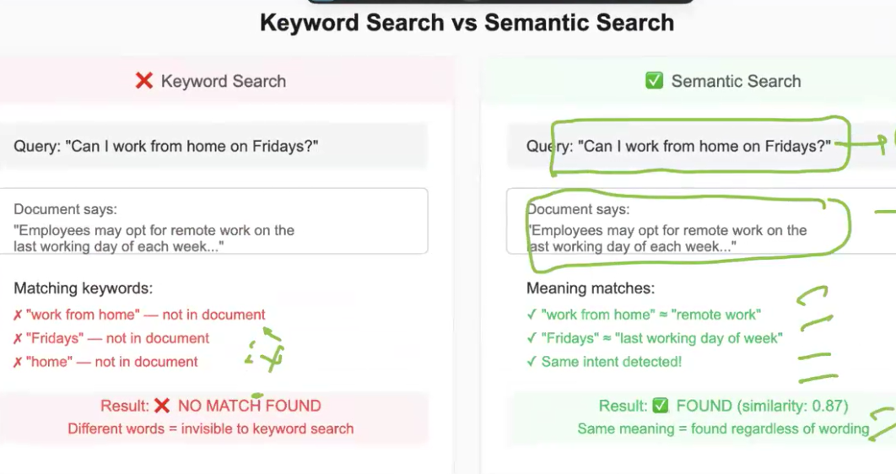
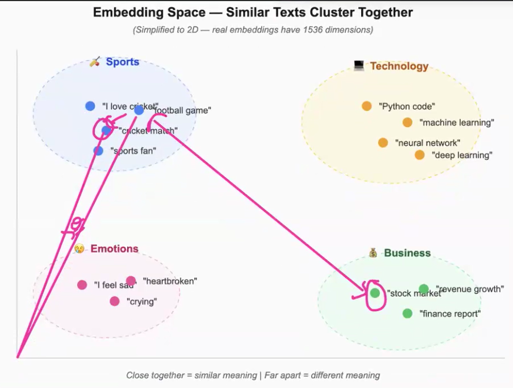

### **EMBEDDINGS AND SEMANTIC RETRIEVAL SYSTEMS**

- In ML, we use One-hot encoding to represent categorical variables as binary vectors. However, this approach has limitations, especially when dealing with large vocabularies or complex relationships between words.They loose the meaning of the word. To overcome these limitations, we use embeddings, whcih are some numeric values provided to text.
- Embeddings preserve "Semantic meaning" of the words, which means that words with similar meanings will have similar embeddings. For example, the words "king" and "queen" will have similar embeddings because they are related concepts.
- Sample scenario: Usually, when we wnat to search for a policy in our company policy document, like work from policy, we usually, do Ctrl+F and search for the word "work from home" in the document. But if the policy is written as "Remote work policy", we will not be able to find it. This is where embeddings come into play. We can use embeddings to represent the words in the document and then use semantic retrieval techniques to find the relevant policy, even if the exact words are not present.
.
- **Semantic** in the sense, similar meaning words will have similar embeddings. "Keyword Search" fails over "Semantic Search" because it only looks for exact matches of the keywords, while semantic search looks for the meaning behind the words. For example, if we search for "work from home policy" in a document that contains the phrase "remote work policy", a keyword search would not return any results, while a semantic search would be able to find the relevant policy.
- 
- The technique of converting a text into a vector(a point in a plane) while preserving the semantic meaning of the text is called **Embeddings**. The vector representation of the text is called **Embeddings**. The process of converting a text into a vector is called **Embedding Generation**.
- When two points are close in a vector plane, then they are sematically similar.
- **Embedding Models** : Thease are the models whcih create vectors for the text. The Embedding models are builts on top of "Transformers". Transformers are built on a top of a technique called "Attention Mechanism/Self-Attention". The attention mechanism allows the model to focus on different parts of the input text when generating the embeddings. This allows the model to capture the meaning of the text more effectively.
- 
- The abgle in the image is known as "Cosine Similarity". Cosine similarity is a measure of similarity between two vectors. It is calculated as the cosine of the angle between the two vectors. The cosine similarity ranges from -1 to 1, where 1 means the vectors are identical, 0 means they are orthogonal (unrelated), and -1 means they are diametrically opposed.