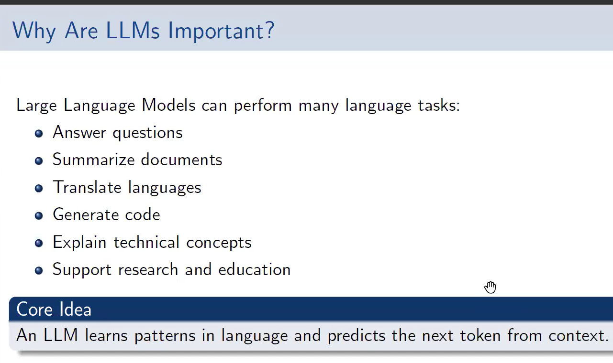
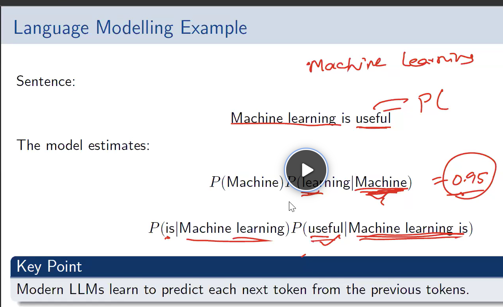
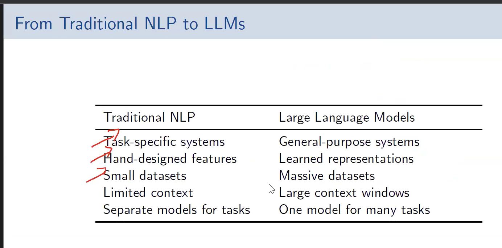
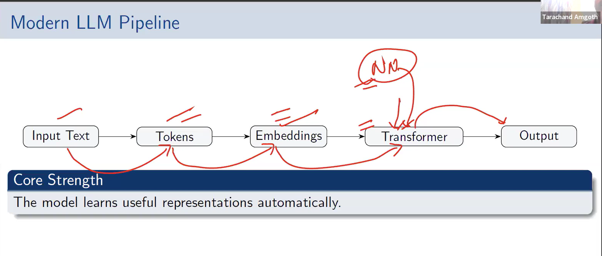
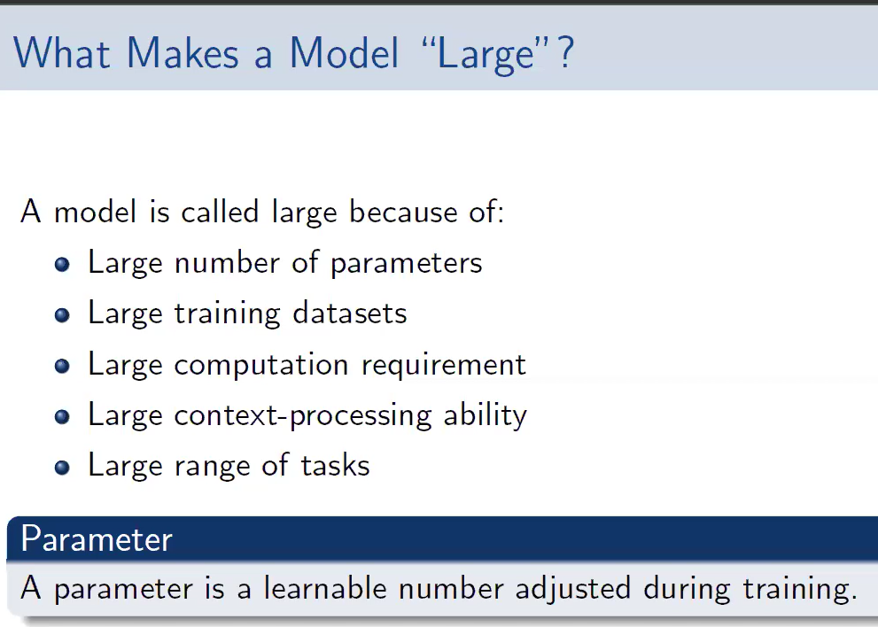

# INTRODUCTION TO LARGE LANGUAGE MODELS(LLM's)\

```text
Artificial Intelligence
        │
        ├── Machine Learning
        │      │
        │      └── Deep Learning
        │              │
        │              └── Large Language Models(LLMs)
        │                      │
        │                      └── Generative AI
        │                               │
        │                               └── AI Agents
        │                                        │
        │                                        └── Agentic AI
```

- The above is the entire hierarchy of AI, starting from Artificial Intelligence to Agentic AI. The focus of this module is on Large Language Models(LLMMs) and their applications in Generative AI and AI Agents. 
- 






### Difference between Parameter and Hyper-parameter.
- **Parameters** are LEARNED by the model. **Hyperparameters** are SET by the human before training.
## Parameter vs Hyperparameter

| Feature | Parameter | Hyperparameter |
|----------|-----------|----------------|
| **Who decides it?** | Model | Human / Data Scientist |
| **When is it decided?** | During training | Before training |
| **Changes during training?** | ✅ Yes | ❌ No (usually) |
| **Purpose** | Learns patterns from the training data | Controls how the model learns |
| **Can it be optimized automatically?** | ✅ Yes | ❌ No (requires tuning) |
| **Examples** | Weights, Biases, Coefficients | Learning Rate, Epochs, Batch Size, Number of Trees, Max Depth |
| **Where is it used?** | Inside the trained model | In the training algorithm |
| **Effect on model** | Determines the model's predictions | Determines the quality and speed of learning |

> **Hyperparameters = How the model learns.**  
> **Parameters = What the model learns.**