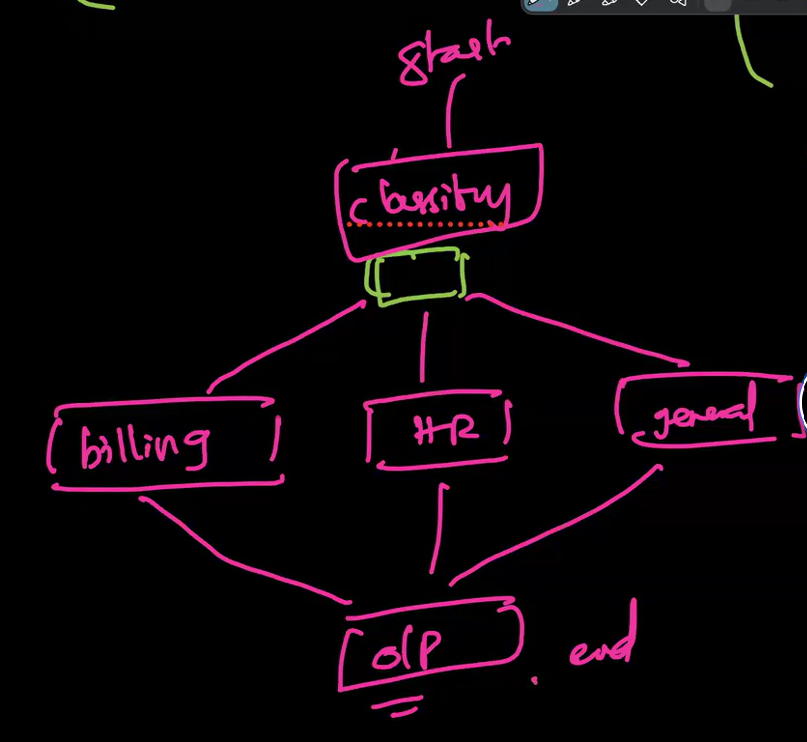

### ORCHESTRATION AND AGENT WORKSLOW.

- In a normal workflow, a single agent is responsible for executing a task. However, in complex scenarios, multiple agents may need to collaborate to achieve a common goal. This is where orchestration comes into play.
- Orchestration involves coordinating the actions of multiple agents, ensuring that they work together efficiently and effectively. It allows for the delegation of tasks, management of dependencies, and synchronization of activities among agents.
- "LangChain" is used to implement a straight throught process, where the output of one agent can be used as the input for another agent, creating a seamless flow of information and actions. This enables the creation of sophisticated workflows that can handle complex tasks and scenarios.
- but everytime, it is not going to be a straight through process, Thre might be multiple agents working in parallel. That is where "LangGraph" comes into play, which allows for the creation of more complex workflows with multiple agents working in parallel, each contributing to the overall goal. This enables the development of advanced applications that can handle a wide range of tasks and scenarios.

#### State Graphs: 
It is a directed graph that represents the flow of information and actions between agents in a workflow. 

#### Nodes:
Each node in the graph represents an agent or a task that needs to be executed. Nodes can have inputs and outputs, which define the data that is required for the task and the data that is produced as a result of the task. It is nothing but the python function that is going to be executed by the agent.

#### Edges: 
The edges in the graph represent the dependencies between nodes. An edge from node A to node B indicates that the output of node A is required as input for node B. This allows for the creation of complex workflows where tasks can be executed in a specific order based on their dependencies.

#### Conditional edges: 
In addition to standard edges, state graphs can also include conditional edges that allow for branching based on specific conditions. This enables the creation of workflows that can adapt to different scenarios and handle a wide range of tasks.

#### State: 
It is the shared data that is accessible to all agents in the workflow. The state can be used to store information that is required for the execution of tasks, such as intermediate results or configuration settings. It allows for the sharing of data between agents and enables the creation of workflows that can adapt to changing conditions.

#### Typedict:
It id a class, where we define the structure of the state, including the types of data that are expected to be stored in the state. This allows for the creation of workflows that can handle a wide range of data types and ensures that the data is structured in a way that is compatible with the tasks being executed by the agents. At runtime, this is also a normal dictionary only. Just for our reference and suggestions in our IDE, we are using Typedict. We use type dict in LLM flows because, the response from each LLM/agent can be appended to the state. This is a reason why we are not using Pydantic model, because Pydantic model enforces strict validation on the keys-values and their types.