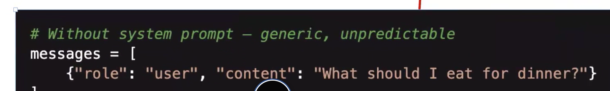
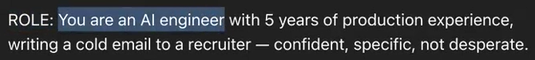
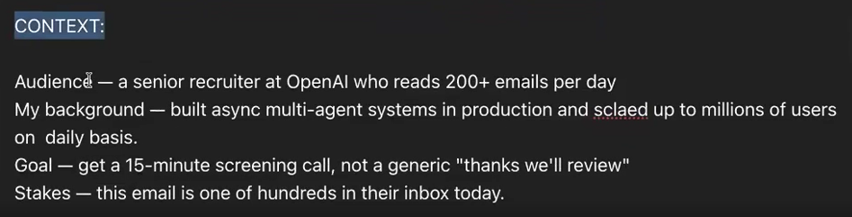
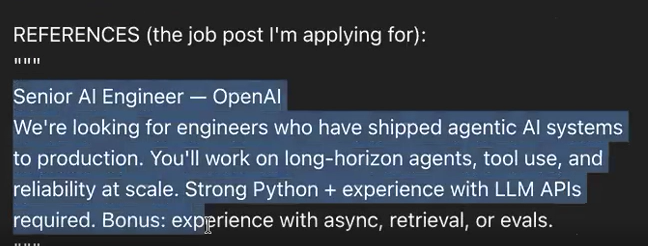
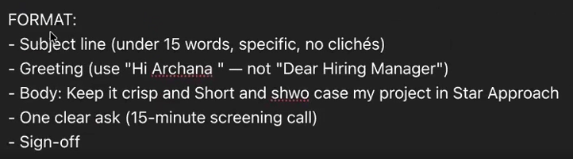
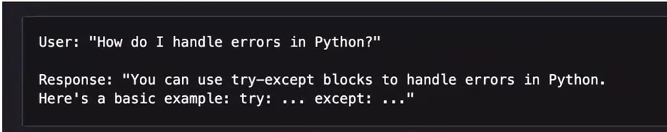
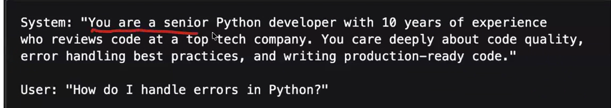
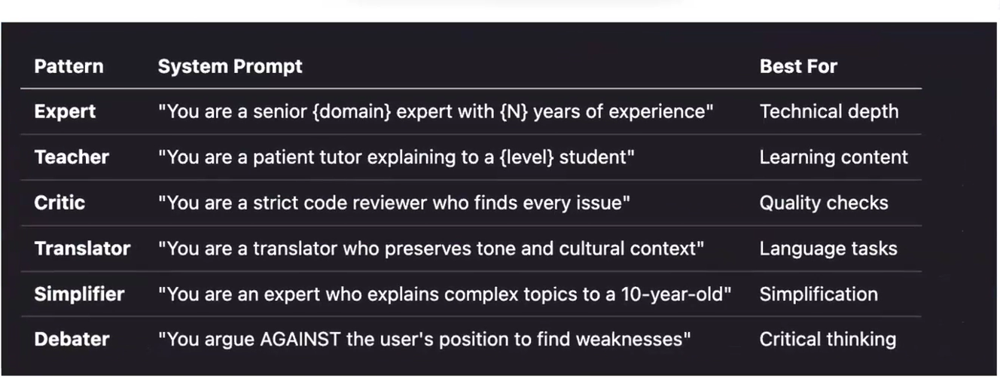
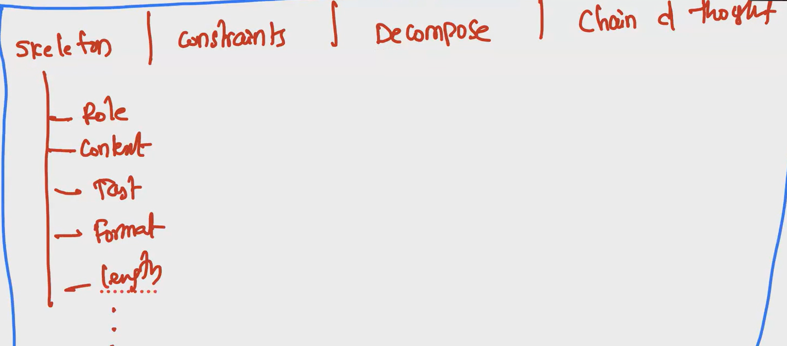
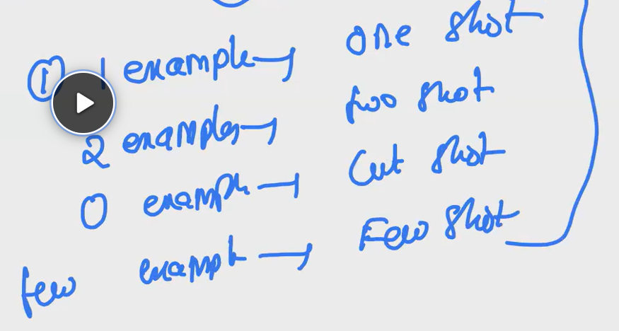

## PROMPT ENGINEERING

### What is Prompt Engineering?
Prompt engineering is the process of designing and refining prompts to effectively communicate with large language models (LLMs) and elicit desired responses. It involves crafting input text that guides the model's behavior, ensuring that it generates relevant, accurate, and contextually appropriate outputs.

### Types of Prompts
- **System Prompts:** These are instructions or context provided to the model to set the stage for its responses. They can include specific guidelines, constraints, or background information that influence how the model interprets and responds to user queries. Basically, we will be setting the background or persona for the model. Examples of system prompts include:
  - "You are a helpful assistant that provides concise answers."
  - "Please summarize the following text in three sentences."
  - "Translate the following paragraph into French."
- **User Prompts:** These are the actual queries or requests made by users to the model. Examples of user prompts include:
  - "What is the capital of France?"
  - "Can you explain the theory of relativity?"
  - "Write a poem about the ocean."
- **Assistant Prompts:** These are responses generated by the model based on the system and user prompts, which can be further refined or adjusted through iterative prompting. These are from memory. Examples of assistant prompts include:
  - "The capital of France is Paris."
  - "The theory of relativity, developed by Albert Einstein, describes the relationship between space, time, and gravity."
  - "Here is a poem about the ocean: 'The ocean's waves dance under the moonlight, whispering secrets to the shore.'"

***So, system and user prompts are provided by the user interacting with the LLM, while assistant prompts are generated by the LLM itself.***

- When we usually chat with chatGPT, prompt engineering is automatically done by the system prompt, which is hidden from the user. The system prompt sets the context and behavior of the model, while the user prompt is the input provided by the user. The assistant prompt is the model's response to the user's input, influenced by both the system and user prompts.
- But when we work with API's, we have to provide the system prompt explicitly, along with the user prompt, to guide the model's behavior and ensure that it generates the desired responses. The assistant prompt is then generated by the model based on the provided prompts. Eg:

### How to make a prompt effective?
There is basically a skeliton of a prompt, which is as follows:
- **Role:** Define the role or persona of the model. This sets the context for how the model should respond.
- **Context:** Provide relevant background information or context that the model needs to understand the task or query.
- **Task:** Clearly state the specific task or question that the model should address.
- **Format:** Specify the desired format or structure of the model's response, if applicable.
- **Length (optional):** Indicate any constraints on the length of the response, such as word count or character limit.

### EXAMPLE PROMPT: 
***Bad Prompt:***

***Good Prompt:***

Till now we have seen how the O/P of LLM's to be. With **Constraints/Negatives**, we can control hwhat we don't want from LLM, as O/P. This is very important in prompt engineering, as it helps to refine the model's responses and ensure that they align with the user's expectations and requirements. By specifying constraints or negatives, we can guide the model to avoid certain types of outputs or behaviors, leading to more accurate and relevant results. Eg: If we want to generate a story, but we don't want it to be scary, we can specify that constraint in the prompt. This will help the model understand our preferences and generate a story that meets our expectations, like 

***Good Prompt:*** "Write a story about a magical adventure, but avoid any scary or frightening elements."
Eg: ***Bad Prompt***

***Good Prompt***:

### Best practices, to improve the effectiveness of prompts:
- ***Roles*** 

### DECOMPOSITION OF PROMPTS
- **Decomposition of prompts** is a technique used in prompt engineering to break down complex tasks or queries into smaller, more manageable components. This approach allows for more precise control over the model's behavior and can lead to improved performance and more accurate responses. By decomposing prompts, we can guide the model through a step-by-step process, ensuring that it addresses each aspect of the task effectively.
- **Benefits of Decomposition:**
  - Improved clarity and focus: Decomposing prompts helps to clarify the specific requirements of a task, making it easier for the model to understand and respond appropriately.
  - Enhanced control over model behavior: By breaking down tasks into smaller components, we can exert greater control over the model's responses, ensuring that they align with our expectations.
  - Increased accuracy and relevance of responses: Decomposition allows for more targeted prompting, which can lead to more accurate and contextually relevant outputs from the model.  

  

  ### ZERO SHOT AND FEW SHOT PROMPTING
- **Zero-shot prompting** is a technique in which a model is given a task or query without any prior examples or context. The model must rely solely on its pre-trained knowledge and understanding of language to generate a response. This approach can be useful for tasks where the model has sufficient knowledge to provide accurate answers without additional guidance. Eg: "Translate the following sentence into Spanish: 'The cat is on the roof.'"
- **Few-shot prompting** is a technique in which a model is provided with a small number of examples or context to help guide its response to a task or query. By providing a few relevant examples, the model can better understand the desired output format and content, leading to improved performance and more accurate responses. This approach is particularly useful for tasks that require specific formatting or adherence to certain conventions. Eg:   "Summarize the following paragraphs in one sentence: [Paragraph 1] [Paragraph 2] [Paragraph 3]"
