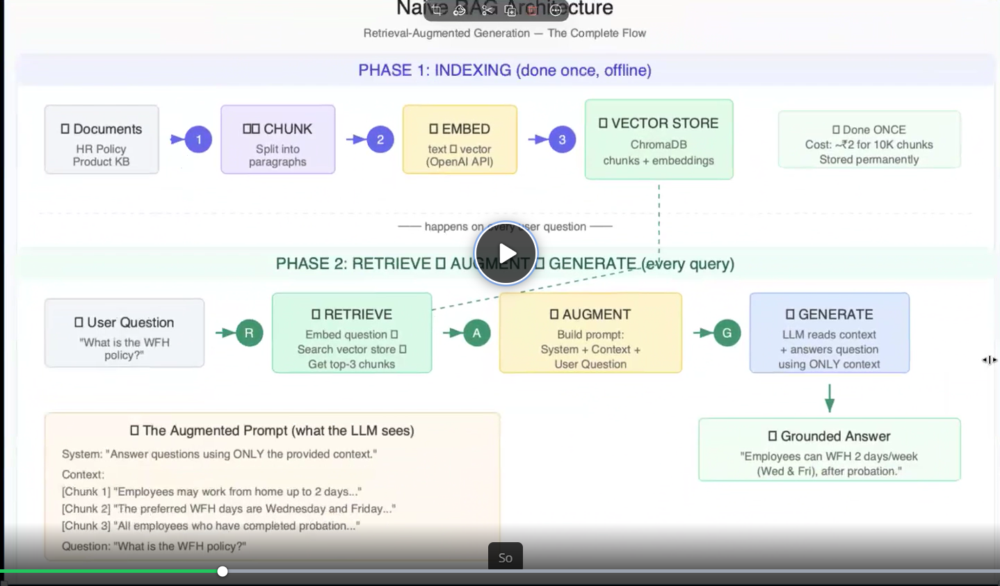
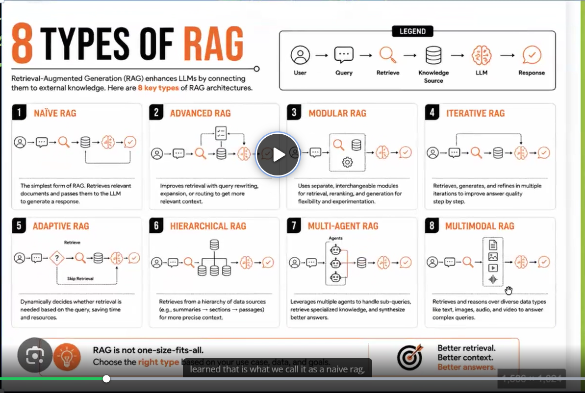

# RAG - Retrieval-Augmented Generation
- Usually, when we ask an LLM a question regarding my company's policy,it confidently generates data, which is hallucinated and not accurate. This is because the LLM does not have access to my company's policy documents. To solve this problem, we can use RAG (Retrieval-Augmented Generation) to retrieve relevant information from my company's policy documents and provide it to the LLM for generating accurate responses.
- My company's policy documents are highly confidential and cannot be shared with the LLM. That is when RAG comes into play. RAG allows us to retrieve relevant information from my company's policy documents without exposing the entire document to the LLM. This way, we can ensure that the LLM generates accurate responses based on the retrieved information while keeping the policy documents confidential.
- One more issue w/o RAG is, my policy document or any other confidential doc of that matter, will be very large. So,, on uploading thease large documents to LLM, the entire context window of the LLM will be filled with the document, leaving no space for the actual question. And also, so costly.
- This will result in the LLM not being able to generate accurate responses.
- RAG is actually a helper hand for LLM, by proviing the info, so that LLM can build an answer around it.

-------------------------------------------------------------

### Example scenario:

- Let's say we have a 1000 policy document that contains information about my company's all the policies. Now a chat bot has to be built so that, I f I ask any ques related to the above docs, the chatbot shld be able to answer.
- We cannot use any Inference providers(Groq,OpenAI etc), bcoz as seen earlier, it is costly and also data breach is inevitable. 
-------------------------------------------------------------
- For the above scenario, there are two phases:
  1. **Indexing Phase**: In this phase, we will index the 1000 policy documents using a vector database. The vector database will store the embeddings of the documents, which will allow us to retrieve relevant information quickly and efficiently.
  2. **Query/Retrieval Phase**: In this phase, when a user asks a question, we will retrieve relevant information from the vector database using the embeddings of the question. The retrieved information will then be provided to the LLM for generating accurate responses. 

### INDEXING PHASE:
- Here the 1000 policy documents will be converted into chunks, then embeddings will be created for each chunk using chromaDB's default embedding model(for our case, since we are using chromaDB). The embeddings will be stored in a vector database(chromaDB), which will allow us to retrieve relevant information quickly and efficiently.
- Now we will also store the metadata of each chunk in the vector database, i.e, 
  - Document ID
  - Chunk ID
  - Chunk Text
  - Embedding Vector
#### INDEXING PIPELINE:
  
- This will be done only once, unless and untill the data changes, then we will have to re-index the data. The indexing phase is a one-time process, and it can be done offline.

### QUERY/RETRIEVAL PHASE:
- The user will ask a question like "What is the policy regarding remote work?" The question will be **converted into an embedding using the same embedding model used in the indexing phase**. The embedding of the question will then be used to retrieve relevant chunks from the vector database based on their similarity to the question embedding.
- The cosine similarity of the user question embedding and the chunk embeddings will be calculated, and the top-k most similar chunks will be retrieved from the vector database. The retrieved chunks will then be provided to the LLM for generating accurate responses.
- Now the retrieved vectors if sent directly to user, they will not nderstand. So, now what we will do is, using the top-k retrieved chunks, we will get the plain text from the vector database.
- Thease chunks might be incoplete, since they are cut in our indexing phase. So, now to get the user with an answer which they understand, we will introduce an LLM in b/w user and the retrieved chunks. The LLM will take the retrieved chunks as input and generate a coherent and complete answer to the user's question. This way, we can ensure that the user gets an accurate and understandable response based on the retrieved information from my company's policy documents.
- TNow we call this pipeline as **RAG (Retrieval-Augmented Generation) pipeline**, where we are augmenting the LLM with relevant information retrieved from my company's policy documents to generate accurate responses to user queries.
- The answer we received from LLM is known as **Grounded answer**, since it is originated in the retrieved information from my company's policy documents. This way, we can ensure that the LLM generates accurate responses based on the retrieved information while keeping the policy documents confidential.

#### What are the tings that we have to keep in mind while building a RAG pipeline:
- **Retrieval Quality::** The quality of the retrieved information is crucial for generating accurate responses. If the retrieved information is
- ***Embedding Model/Technique:** The choice of embedding model can significantly impact the quality of the embeddings and, consequently, the retrieval performance. It is essential to select an embedding model that captures the semantic meaning of the text effectively.
- **Retrieval Speed:** The retrieval speed is important for providing a responsive user experience. Optimizing the retrieval process and using efficient data structures can help achieve faster retrieval times.

### TYPES OF RAG:

 
### TYPES OF CHUNKING:
- **Fixed-size chunking:** In this method, the text is divided into chunks of a fixed size, such as 512 tokens. This approach is simple and easy to implement but may result in chunks that do not align with the natural structure of the text, potentially leading to loss of context.
- **Semantic chunking:** In this method, the text is divided into chunks based on semantic boundaries, such as paragraphs or sections. This approach preserves the natural structure of the text and maintains context, but it may result in variable-sized chunks that can be more challenging to manage.
- **Hybrid chunking:** This method combines fixed-size and semantic chunking approaches. It divides the text into fixed-size chunks while also considering semantic boundaries to ensure that the chunks maintain context. This approach aims to balance simplicity and context preservation.
- **Overlapping chunking:** In this method, the text is divided into chunks with overlapping content. This approach helps maintain context across chunks and can improve retrieval performance, but it may result in increased storage requirements and complexity in managing the chunks.
- **Dynamic chunking:** In this method, the text is divided into chunks based on dynamic criteria, such as the content's complexity or the user's query. This approach allows for more flexible chunk sizes and can adapt to different types of content, but it may require more sophisticated algorithms to determine the optimal chunking strategy.
- **Hierarchical chunking:** In this method, the text is divided into chunks at multiple levels of granularity, such as sections, paragraphs, and sentences. This approach allows for more fine-grained retrieval and can improve the quality of the retrieved information, but it may require more complex indexing and retrieval algorithms.

And soooo on......

### How to evaluate RAG:
- Consistency of the answers for the same question.
- Reliability of the answers across different questions.
- Accuracy of the answers based on the retrieved information.
- Factualness of the answers based on the retrieved information. 

All the above has to be checked by creatinhg the testcases (manual Q&A from docs) and then comparing the answers generated by RAG with the expected answers.

- If the answers generated by RAG are consistent, reliable, accurate, and factual, then we can say that the RAG pipeline is working as expected. If not, then we need to fine-tune the RAG pipeline by improving the retrieval quality, embedding model, and retrieval speed.